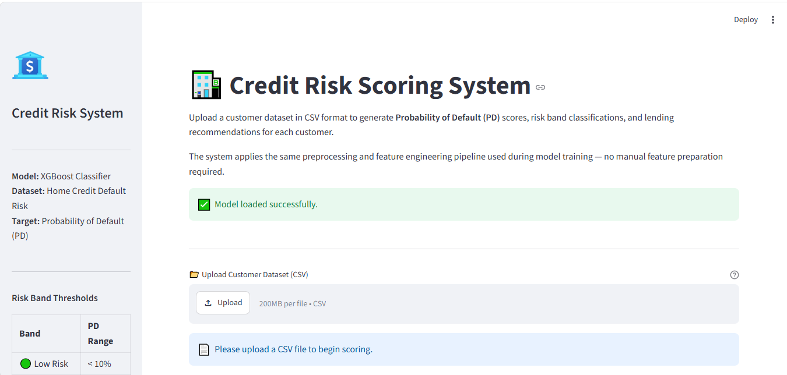

# Credit Risk Modeling — Probability of Default (PD) Model

[](https://www.python.org/)
[](https://xgboost.readthedocs.io/)
[](https://streamlit.io/)
[](https://scikit-learn.org/)

A **production-ready** Credit Risk Modeling project that predicts the Probability of Default (PD) for loan applicants using the [Home Credit Default Risk](https://www.kaggle.com/competitions/home-credit-default-risk) dataset.



---

## Table of Contents

1. [Business Problem](#1-business-problem)
2. [Project Architecture](#2-project-architecture)
3. [Folder Structure](#3-folder-structure)
4. [Dataset](#4-dataset)
5. [Setup Instructions](#5-setup-instructions)
6. [Pipeline: Step-by-Step Instructions](#6-pipeline-step-by-step-instructions)
   - [Run Data Preparation](#step-1-run-data-preparation)
   - [Run Training](#step-2-run-training)
   - [Run Evaluation](#step-3-run-evaluation)
   - [Run Prediction](#step-4-run-prediction)
   - [Run Streamlit App](#step-5-run-streamlit-app)
7. [Notebook Workflow](#7-notebook-workflow)
8. [Model & Features](#8-model--features)
9. [Evaluation Metrics](#9-evaluation-metrics)
10. [Risk Bands & Business Decisions](#10-risk-bands--business-decisions)
11. [Troubleshooting Guide](#11-troubleshooting-guide)
12. [Production Checklist](#12-production-checklist)

---

## 1. Business Problem

Financial institutions face significant losses when borrowers fail to repay loans.  
Poor lending decisions lead to:

- Financial losses and provisioning
- Reduced profitability
- Higher capital requirements under Basel III/IV

**Goal:** Build a machine learning model that estimates the **Probability of Default (PD)** for each loan applicant using their demographic, financial, and credit bureau data — enabling lenders to make better, data-driven credit decisions.

> Expected Loss = **PD** × LGD × EAD
>
> This project focuses on the PD component. LGD and EAD modeling are planned as future work.

**Target variable:**

- `TARGET = 1` → Customer defaulted (repayment difficulties)
- `TARGET = 0` → Customer did not default

**Class imbalance:** ~8.1% of applicants default — the model explicitly handles this via `scale_pos_weight` and optimal threshold selection.

---

## 2. Project Architecture

```
Raw CSV (application_train.csv)
        │
        ▼
┌───────────────────────────────────────────────┐
│  src/pipeline.py  (Data Preparation)          │
│  ├── preprocess.py   ← FIT & SAVE artifacts   │
│  │   ├── Anomaly replacement (DAYS_EMPLOYED)  │
│  │   ├── Median imputation (per-column)        │
│  │   ├── Outlier capping (p1/p99)             │
│  │   └── Label encoding (all categoricals)    │
│  └── feature_engineering.py                  │
│      ├── Financial ratios (6 features)        │
│      ├── EXT_SOURCE aggregates (6 features)   │
│      ├── Age & employment (3 features)        │
│      └── Behavioural signals (2 features)     │
└───────────────────────────────────────────────┘
        │
        ▼  data/processed/model_data.csv
┌───────────────────────────────────────────────┐
│  src/train.py  (Model Training)               │
│  ├── Stratified 5-fold CV                    │
│  ├── 60/20/20 Train/Val/Test split            │
│  ├── XGBoost + early stopping                 │
│  └── Optimal threshold selection (PR curve)   │
└───────────────────────────────────────────────┘
        │
        ▼  artifacts/ (model, encoders, imputer, threshold, features)
┌───────────────────────────────────────────────┐
│  src/evaluate.py  (Model Evaluation)          │
│  └── ROC-AUC, Gini, KS, PR-AUC, F1, …       │
└───────────────────────────────────────────────┘
        │
┌───────────────────────────────────────────────┐
│  src/predict.py  (Inference)                  │
│  ├── Loads fitted preprocessors               │
│  ├── Applies identical pipeline to new data   │
│  └── Outputs PD score, Risk Band, Decision    │
└───────────────────────────────────────────────┘
        │
┌───────────────────────────────────────────────┐
│  app.py  (Streamlit Web Application)          │
│  ├── CSV upload & validation                  │
│  ├── Batch scoring with cached model          │
│  ├── Portfolio dashboard & visualisations     │
│  └── Downloadable scored CSV                  │
└───────────────────────────────────────────────┘
```

**No training-serving skew:** The preprocessing artifacts (imputer medians, outlier bounds, label encoder mappings) are fitted on training data only and persisted. At inference time, the exact same artifacts are loaded — guaranteeing identical transformations.

---

## 3. Folder Structure

```
credit-risk-pa-model/
│
├── data/
│   ├── raw/
│   │   └── application_train.csv          ← Kaggle dataset (download separately)
│   └── processed/
│       └── model_data.csv                  ← Generated by pipeline.py
│
├── notebooks/
│   ├── 01_business_understanding.ipynb
│   ├── 02_data_quality_and_eda.ipynb
│   ├── 03_feature_engineering.ipynb
│   ├── 04_baseline_logistic_regression.ipynb
│   ├── 05_xgboost_credit_risk_model.ipynb
│   ├── 06_shap_explainability.ipynb
│   └── 07_business_recommendations_and_executive_summary.ipynb
│
├── artifacts/                              ← Generated by train.py
│   ├── xgb_credit_risk_model_v2.pkl
│   ├── median_imputer_v2.pkl              ← Fitted preprocessing artifacts
│   ├── label_encoders_v2.pkl
│   ├── optimal_threshold_v2.pkl
│   ├── credit_risk_feature_names_v2.pkl
│   ├── test_predictions_v2.csv
│   ├── model_metrics_v2.csv
│   ├── model_comparison.csv
│   └── shap_feature_importance_v2.csv
│
├── logs/
│   └── credit_risk.log
│
├── reports/
│
├── src/
│   ├── __init__.py
│   ├── config.py              ← All paths, hyperparameters, logging
│   ├── preprocess.py          ← Cleaning, imputation, encoding (fit & transform)
│   ├── feature_engineering.py ← All feature creation
│   ├── pipeline.py            ← End-to-end data preparation
│   ├── train.py               ← Model training with CV & early stopping
│   ├── evaluate.py            ← Comprehensive metric evaluation
│   ├── predict.py             ← Batch & single customer inference
│   └── utils.py               ← Shared helpers, logging, artifact I/O
│
├── app.py                     ← Streamlit web application
├── requirements.txt
└── README.md
```

---

## 4. Dataset

**Source:** [Kaggle — Home Credit Default Risk](https://www.kaggle.com/competitions/home-credit-default-risk/data)

| File                    | Description                                   |
| ----------------------- | --------------------------------------------- |
| `application_train.csv` | 307,511 loan applications with labels         |
| `application_test.csv`  | 48,744 applications without labels (optional) |

**This project uses only `application_train.csv`** for a clean supervised learning setup.

Key statistics:

- 307,511 customers
- 122 raw features → ~140+ after feature engineering
- 8.1% default rate (class imbalance handled)

---

## 5. Setup Instructions

### Prerequisites

- Python 3.10 or higher
- pip

### Step-by-step

```bash
# 1. Clone / navigate to the project
cd credit-risk-pa-model

# 2. Create and activate a virtual environment
python -m venv venv
# Windows:
venv\Scripts\activate
# macOS/Linux:
source venv/bin/activate

# 3. Install dependencies
pip install -r requirements.txt

# 4. Download the dataset from Kaggle
#    Place application_train.csv in:
#    data/raw/application_train.csv
```

---

## 6. Pipeline: Step-by-Step Instructions

### Step 1: Run Data Preparation

Preprocesses and feature-engineers the raw data.  
Fits and saves all preprocessing artifacts (imputer, encoders, caps).

```bash
python src/pipeline.py
```

**Output:** `data/processed/model_data.csv` + artifacts in `artifacts/`

---

### Step 2: Run Training

Trains the XGBoost model with 5-fold cross-validation and early stopping.

```bash
python src/train.py
```

**Output:**

- `artifacts/xgb_credit_risk_model_v2.pkl`
- `artifacts/optimal_threshold_v2.pkl`
- `artifacts/test_predictions_v2.csv`
- `artifacts/credit_risk_feature_names_v2.pkl`

---

### Step 3: Run Evaluation

Loads the saved test predictions and computes all metrics.

```bash
python src/evaluate.py
```

**Output:** `artifacts/model_metrics_v2.csv`

**Metrics reported:** ROC-AUC, Gini, PR-AUC, KS Statistic, Precision, Recall, F1 (at optimal threshold), Classification Report, Confusion Matrix.

---

### Step 4: Run Prediction

Score a batch CSV or a single customer dict.

```bash
# Single customer demo
python src/predict.py

# In Python code (batch):
from src.predict import score_dataframe
import pandas as pd

df = pd.read_csv("my_customers.csv")
scored = score_dataframe(df)
scored[["Prediction", "Probability_Default", "PD", "Risk_Band"]].head()
```

---

### Step 5: Run Streamlit App

```bash
streamlit run app.py
```

Open your browser at `http://localhost:8501`.

1. Upload a CSV with the same columns as `application_train.csv`
2. The app scores all customers automatically
3. View the portfolio dashboard and risk distribution
4. Download the scored CSV

---

## 7. Notebook Workflow

Run notebooks **in order**:

| #   | Notebook                 | Purpose                                               |
| --- | ------------------------ | ----------------------------------------------------- |
| 01  | Business Understanding   | Problem framing, dataset overview, class imbalance    |
| 02  | Data Quality & EDA       | Missing value analysis, distributions, correlations   |
| 03  | Feature Engineering      | All feature creation (mirrors feature_engineering.py) |
| 04  | Logistic Regression      | Baseline model                                        |
| 05  | XGBoost Model            | Champion model with CV, early stopping, evaluation    |
| 06  | SHAP Explainability      | Global + local model explanations                     |
| 07  | Business Recommendations | Executive summary, risk bands, portfolio strategy     |

> **SHAP Fix (Notebook 06):** Use `shap.TreeExplainer(xgb_model)` — pass the
> sklearn wrapper directly, NOT `xgb_model.get_booster()`. This resolves the
> `[5E-1]` ValueError in SHAP ≥ 0.44.

---

## 8. Model & Features

### Model

**XGBoost Classifier** with:

- `scale_pos_weight` for class imbalance
- Early stopping (50 rounds patience)
- 5-fold stratified cross-validation
- Optimal decision threshold (PR-curve F1 maximisation)

### Engineered Features

| Feature                | Formula                            | Signal                          |
| ---------------------- | ---------------------------------- | ------------------------------- |
| `CREDIT_INCOME_RATIO`  | AMT_CREDIT / AMT_INCOME_TOTAL      | Loan burden                     |
| `ANNUITY_INCOME_RATIO` | AMT_ANNUITY / AMT_INCOME_TOTAL     | Monthly payment capacity        |
| `GOODS_CREDIT_RATIO`   | AMT_GOODS_PRICE / AMT_CREDIT       | Loan-to-value                   |
| `ANNUITY_CREDIT_RATIO` | AMT_ANNUITY / AMT_CREDIT           | Implicit interest rate          |
| `CREDIT_PER_PERSON`    | AMT_CREDIT / CNT_FAM_MEMBERS       | Family credit exposure          |
| `INCOME_PER_PERSON`    | AMT_INCOME_TOTAL / CNT_FAM_MEMBERS | Family income capacity          |
| `EXT_SOURCE_MEAN`      | Mean of EXT_SOURCE_1/2/3           | External credit score aggregate |
| `EXT_SOURCE_MIN`       | Min of EXT_SOURCE_1/2/3            | Worst bureau score              |
| `EXT_SOURCE_STD`       | Std of EXT_SOURCE_1/2/3            | Score volatility                |
| `EXT_SOURCE_PRODUCT`   | Product of all 3 scores            | Combined signal                 |
| `EMPLOYMENT_AGE_RATIO` | \|DAYS_EMPLOYED\| / \|DAYS_BIRTH\| | Employment stability            |
| `AGE_YEARS`            | \|DAYS_BIRTH\| / 365.25            | Applicant age                   |
| `EMPLOYMENT_YEARS`     | \|DAYS_EMPLOYED\| / 365.25         | Employment tenure               |
| `DOCUMENT_COUNT`       | Sum of FLAG*DOCUMENT*\*            | Documentation thoroughness      |
| `BUREAU_INQUIRY_TOTAL` | Sum of AMT*REQ_CREDIT_BUREAU*\*    | Credit-seeking behaviour        |

---

## 9. Evaluation Metrics

| Metric           | Description                                         | Typical Target                |
| ---------------- | --------------------------------------------------- | ----------------------------- |
| **ROC-AUC**      | Discrimination ability                              | > 0.75 good, > 0.80 excellent |
| **Gini**         | 2×AUC − 1; credit industry standard                 | > 0.50 good                   |
| **KS Statistic** | Max separation of score distributions               | > 0.30 good                   |
| **PR-AUC**       | Precision-Recall balance (imbalanced classes)       | Context-dependent             |
| **F1**           | Precision-Recall harmonic mean at optimal threshold | Higher is better              |

---

## 10. Risk Bands & Business Decisions

| PD Score | Risk Band         | Recommendation   | Action                             |
| -------- | ----------------- | ---------------- | ---------------------------------- |
| < 10%    | 🟢 Low Risk       | Approve          | Fast-track; competitive rate       |
| 10–30%   | 🟡 Medium Risk    | Manual Review    | Standard underwriting              |
| 30–50%   | 🟠 High Risk      | High Risk Review | Income verification; reduced limit |
| ≥ 50%    | 🔴 Very High Risk | Reject           | Decline; escalate to risk team     |

---

## 11. Troubleshooting Guide

### ❌ `FileNotFoundError: Artifact not found`

**Cause:** Model artifacts don't exist yet.  
**Fix:** Run the pipeline and training in order:

```bash
python src/pipeline.py
python src/train.py
```

### ❌ `FileNotFoundError: Raw data not found`

**Cause:** `data/raw/application_train.csv` is missing.  
**Fix:** Download from Kaggle and place the file at the correct path.

### ❌ `ValueError: DataFrame.dtypes for data must be int, float, bool or category`

**Cause:** You are using an old version of the preprocessing code that does not encode categoricals.  
**Fix:** Ensure you are running `src/pipeline.py` from this version of the codebase (not old notebooks).

### ❌ SHAP `ValueError: could not convert string to float: '[5E-1]'`

**Cause:** Using `shap.TreeExplainer(xgb_model.get_booster())` with SHAP ≥ 0.44 and XGBoost ≥ 1.7.  
**Fix:** Use `shap.TreeExplainer(xgb_model)` — pass the sklearn wrapper directly.

### ❌ Streamlit `ModuleNotFoundError`

**Cause:** `src` is not on the Python path.  
**Fix:** Always run Streamlit from the project root:

```bash
# From credit-risk-pa-model/ directory:
streamlit run app.py
```

### ❌ Training is very slow

**Cause:** Large dataset (307,511 rows) + 5-fold CV.  
**Fix:** XGBoost's `tree_method="hist"` is already set for speed.  
For faster prototyping, you can subsample:

```python
df_sample = df.sample(50_000, random_state=42)
```

### ❌ Columns mismatch warning in Streamlit

**Cause:** Your uploaded CSV is missing some columns present in the training data.  
**Fix:** The app fills missing columns with 0 and warns you. For best results, use a CSV with the same structure as `application_train.csv`.

---

## 12. Production Checklist

- [x] No hardcoded paths (all in `config.py`)
- [x] Fitted preprocessing artifacts persisted (no training-serving skew)
- [x] SK_ID_CURR excluded from feature matrix
- [x] TARGET excluded from imputation/capping
- [x] Categorical encoding (label encoding for XGBoost)
- [x] Class imbalance handled (scale_pos_weight)
- [x] Cross-validation (5-fold stratified)
- [x] Early stopping (50 rounds)
- [x] Optimal threshold selection (PR curve)
- [x] SHAP explainability (compatible API)
- [x] All modules have logging
- [x] Error handling with sys.exit(1)
- [x] Streamlit model caching (@st.cache_resource)
- [x] Streamlit column validation
- [x] Output columns: Prediction, Probability_Default, PD, Risk_Band, Recommendation
- [x] Versioned artifacts (MODEL_VERSION = "v2")
- [x] Requirements pinned with version ranges
- [x] README with full documentation
